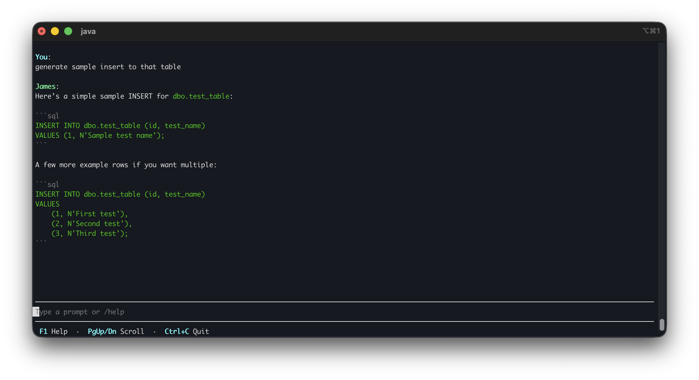

<p align="center">
  
</p>

<p align="center">
  
</p>

# James 

James is a terminal-based (TUI) AI coding agent built entirely in Java.
It connects to Azure OpenAI and provides an interactive assistant that can read, search, edit, and create files in your
codebase, all from the terminal.
James has access to read only db tools for Microsoft SQL Server


## Stack

- TamboUI
- Azure OpenAI
- Spring Boot
- Spring AI
- Java 25

## Requirements

- Java 25
- Maven
- Azure OpenAI Deployment like gpt-5

## Installation

create *env.properties* file from *env.properties.example* and fill:

Azure OpenAI (required):

- `AZURE_OPENAI_API_KEY`
- `AZURE_OPENAI_ENDPOINT`
- `AZURE_OPENAI_DEPLOYMENT_NAME`

Microsoft SQL Server (optional, required only for DB tools):

- `DATABASE_URL`
- `DATABASE_NAME`
- `DATABASE_USER`
- `DATABASE_PASSWORD`
- `DATABASE_PORT`

Or create env variables in your OS <br>
Mac/Linux:
```bash
export AZURE_OPENAI_API_KEY=<your-api-key>
export AZURE_OPENAI_ENDPOINT=<your-endpoint>
export AZURE_OPENAI_DEPLOYMENT_NAME=<your-deployment-name>
export DATABASE_URL=<your-db-host>
export DATABASE_NAME=<your-db-name>
export DATABASE_USER=<your-db-user>
export DATABASE_PASSWORD=<your-db-password>
export DATABASE_PORT=<your-db-port>
```

Windows

```powershell
$env:AZURE_OPENAI_API_KEY="<your-api-key>"
$env:AZURE_OPENAI_ENDPOINT="<your-endpoint>"
$env:AZURE_OPENAI_DEPLOYMENT_NAME="<your-deployment-name>"
$env:DATABASE_URL="<your-db-host>"
$env:DATABASE_NAME="<your-db-name>"
$env:DATABASE_USER="<your-db-user>"
$env:DATABASE_PASSWORD="<your-db-password>"
$env:DATABASE_PORT="<your-db-port>"
```

## Build

### Requirements

- Maven
- JDK
- optional - GraalVm JDK - for native

#### JVM

For running James on JVM run command:

``mvn package``

Then you can run the application with command:

``java -jar target/james-0.0.1.jar``

#### Native

James has support for native image:

``
mvn -Pnative native:compile
``
Run binary with:
``
./target/james
``


